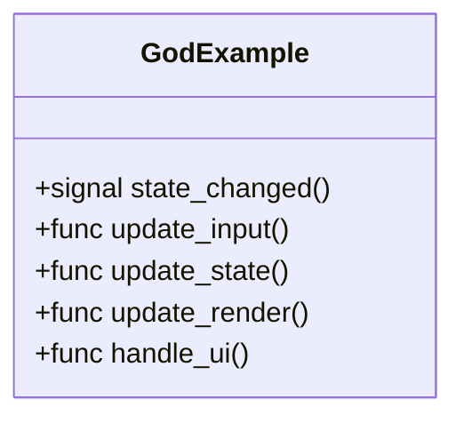
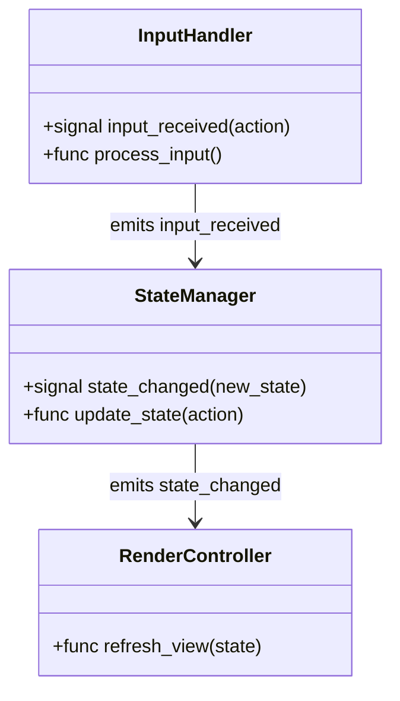

> **Read-only on game code.** This skill scans and reports — it never modifies `src/` or any game asset. Only two files are written: the draft and the final report. If you need to implement a finding, hand it to the appropriate specialist after this skill completes.

## Phase 1 — Detect Engine and Read Context

**Read `.claude/docs/technical-preferences.md`.** Extract the `Engine:` field.

- `[TO BE CONFIGURED]` or missing → **STOP.** Output:
  > "Engine is not configured. Run `/setup-engine` first — this skill's entire value is engine-specific friction detection and cannot produce a meaningful report without it."
  Then exit. Do not produce a generic report.
- `Godot` → set engine = Godot, apply Godot patterns throughout
- `Unity` → set engine = Unity, apply Unity patterns throughout
- `Unreal Engine` / `Unreal` → set engine = Unreal, apply Unreal patterns throughout

**Read `docs/CONTEXT.md`** if it exists. Note canonical system names — use them in the report. Flag terms in the code that are forbidden aliases.

---

## Phase 2 — Enumerate Scope

**Default scan root:** `src/`

**Apply `--focus` if provided:** Restrict all Glob/Grep operations to the specified path (e.g. `--focus src/combat` → only scan `src/combat/**`).

**Apply `--since sprint-N` if provided:**
- This flag is aspirational — if the sprint branch or tag is not in git history, note it and fall back to scanning the full focus path.
- If git history is accessible: limit the file list to files changed since the sprint branch point.

**Mandatory exclusions** (never scan these regardless of `--focus`):

| Engine | Excluded paths |
|--------|---------------|
| Godot | `addons/`, `prototypes/` |
| Unity | `Assets/ThirdParty/`, `Packages/`, `prototypes/` |
| Unreal | `Plugins/`, `Source/ThirdParty/`, `prototypes/` |
| All | `prototypes/`, `tests/`, `tools/` |

**Output:** "Scope: [root path]. Engine: [engine]. Files to scan: approx [N] (estimated from Glob)."

---

## Phase 3 — Scan for Friction Points

Glob all source files in scope. For each file, check the applicable friction patterns below. Log every match: file path, line count if relevant, pattern name, and a one-line description of the specific instance.

Group findings into a table at the end of this phase:

| # | File | Pattern | Description | Severity |
|---|------|---------|-------------|----------|
| 1 | `src/...` | God Script | 420 lines, handles input + state + rendering | HIGH |
| 2 | ... | ... | ... | ... |

Severity:
- **HIGH** — directly impedes future changes; fix before adding features to this system
- **MEDIUM** — technical debt accumulating; address within 2 sprints
- **LOW** — minor smell; log in Deferred bucket

### Godot Friction Patterns

| Pattern | Detection method | Severity default |
|---------|-----------------|-----------------|
| **Autoload sprawl** | Count autoloads in `project.godot`; flag if >5 or if any autoload contains 3+ unrelated responsibilities | HIGH |
| **God Script** | GDScript file >300 lines | HIGH |
| **Scene coupling** | `get_node("../../` direct path traversal in `.gd` files | HIGH |
| **Long signal chain** | Trace `emit_signal`/`.emit()` from file A through B to C — 3+ hops | MEDIUM |
| **Missing `@export`** | Numeric/string literals that appear to be tunable values hardcoded in `_ready` or `@onready` | MEDIUM |
| **Resource duplication** | Same data structure defined in 2+ separate `.gd` files instead of a shared `Resource` | MEDIUM |
| **Uncached node ref** | `get_node()` called inside `_process` or `_physics_process` (not cached in `@onready`) | MEDIUM |

### Unity Friction Patterns

| Pattern | Detection method | Severity default |
|---------|-----------------|-----------------|
| **Singleton sprawl** | `static.*Instance` declarations — flag if >4 or if responsibilities overlap | HIGH |
| **MonoBehaviour bloat** | C# file >300 lines | HIGH |
| **Hot-path FindObjectOfType** | `FindObjectOfType<>()` not in `Awake()`/`Start()` | HIGH |
| **Deep UnityEvent chain** | Trace `UnityEvent.Invoke()` / `AddListener` hops — 3+ | MEDIUM |
| **Hardcoded tunables** | Numeric/string literals in MonoBehaviour that aren't in ScriptableObjects | MEDIUM |
| **Heavy Update()** | Non-trivial logic in `void Update()` — look for loops, allocations, FindObjectOfType | MEDIUM |

### Unreal Friction Patterns

| Pattern | Detection method | Severity default |
|---------|-----------------|-----------------|
| **Blueprint logic** | `.uasset` Blueprint files with complex graphs — flag Blueprint files >100KB as a proxy | HIGH |
| **Cast<> at callsite** | `Cast<[ClassName]>` appearing at 3+ distinct callsites for same class | HIGH |
| **Direct AActor* coupling** | `AActor*` raw pointer member without null guard or interface | HIGH |
| **Heavy Tick()** | Non-trivial logic in `Tick()` — loops, allocations, string operations | MEDIUM |
| **String tag comparison** | String literal compared where `FGameplayTag` or `FName` should be used | MEDIUM |
| **Missing Replicated UPROPERTY** | Properties on networked actors without `Replicated` specifier | MEDIUM |
| **Oversized C++ class** | `.h`/`.cpp` file >500 lines | MEDIUM |

---

## Phase 4 — Identify Deepening Opportunities

For each HIGH and selected MEDIUM friction point from Phase 3, produce a deepening opportunity: a concrete refactor that creates a thin public interface with deep, focused implementations.

For each opportunity:

**Before diagram** — current structure (Mermaid):


**After diagram** — proposed split:


**Prose description:** One paragraph explaining what the refactor achieves and why it reduces future drag.

**Effort estimate:** S (< 2h) / M (2–8h) / L (8h+)

**Integration risk:** LOW / MEDIUM / HIGH (based on caller count from recon)

Use:
- `classDiagram` for dependency/ownership relationships
- `flowchart TD` for signal, event, or delegate flow

Cap at **5 deepening opportunities**. If more than 5 HIGH/MEDIUM findings exist, select the 5 with highest effort-to-value ratio (large blast radius reduction or enabling upcoming sprint work).

---

## Phase 5 — Quick Wins and Deferred

### Quick Wins (no structural refactor required)
Findings fixable in < 30 minutes each, in isolation, without architectural change:

| # | File | Change | Minutes |
|---|------|--------|---------|
| 1 | `src/...` | Cache `get_node()` call in `@onready` | 5 |

Examples: adding `@export` to a hardcoded tunable, moving a `FindObjectOfType` call into `Awake()`, adding a null guard, removing a dead signal connection.

### Deferred (not worth it now)
Findings that are real smells but not worth addressing this sprint:

| # | Finding | Reason to defer |
|---|---------|----------------|
| 1 | Signal chain 3-hops in `ui_manager.gd` | UI rewrite planned in Sprint N+2 — refactoring now would be wasted |

---

## Phase 6 — Write Draft

Write the full report to the draft location before asking for approval.

Draft path: `production/session-state/drafts/entropy-scan-draft-YYYYMMDD-HHMMSS.md`

Replace `YYYYMMDD-HHMMSS` with the current date and time.

The draft contains the complete report in final format (see Phase 7 structure).

If `production/session-state/drafts/` does not exist, create it.

---

## Phase 7 — Approval Gate

Ask:

> "Entropy scan complete. Found [N] friction points: [H] HIGH, [M] MEDIUM, [L] LOW. [K] deepening opportunities identified.
>
> May I write the report to `docs/architecture/entropy-report-[YYYY-MM-DD].md`?"

If approved: proceed to Phase 8.
If declined: output the report inline in the conversation instead. Draft remains in `drafts/` for manual recovery.

---

## Phase 8 — Write Final Report

Verify `docs/architecture/` exists. If not, create it.

Write the report to `docs/architecture/entropy-report-YYYY-MM-DD.md`.

Report structure:

```markdown
# Codebase Entropy Report — [YYYY-MM-DD]

**Engine:** [engine]
**Scan scope:** [path scanned]
**Focus flag:** [--focus value | none]
**Since flag:** [--since value | none]

## Summary

| Category | Count |
|----------|-------|
| HIGH friction points | N |
| MEDIUM friction points | N |
| LOW friction points | N |
| Deepening opportunities | N |
| Quick wins | N |
| Deferred | N |

[2–3 sentence summary of the dominant themes found.]

---

## Friction Points

[Table from Phase 3]

---

## Deepening Opportunities

[Before/after Mermaid + prose for each opportunity from Phase 4]

---

## Quick Wins

[Table from Phase 5]

---

## Deferred

[Table from Phase 5]

---

## Suggested Follow-Ups

- Implement quick wins before next sprint planning — each is < 30 min
- Address HIGH deepening opportunities before adding features to affected systems
- Attach this report as supporting evidence when running `/architecture-review` at the next gate
- For any finding where root cause is unclear: run `/code-recon [file]` before refactoring
```

---

## Verdict

```
Verdict: COMPLETE — [N] friction points found ([H] HIGH, [M] MEDIUM, [L] LOW),
         [K] deepening opportunities, [Q] quick wins.
Report:  docs/architecture/entropy-report-[YYYY-MM-DD].md
Engine:  [detected engine]
Scope:   [scanned path]
```

If engine was not configured at Phase 1: no verdict — skill halted with setup instruction.
