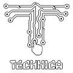

<p align="center">
  
  <h1 align="center">Claude Code Game Studios: Technica Edition</h1>
  <p align="center">
    A CCGS fork that enhances AI agent game development framework with publishing workflow.
    <br />
   Extend base framework with: Go-To-Market Layer,  Post-Launch Lifecycle, and Session Continuity.
  </p>
</p>

<p align="center">
  <a href="LICENSE"></a>
  <a href=".claude/agents"></a>
  <a href=".claude/skills"></a>
  <a href=".claude/hooks"></a>
  <a href=".claude/rules"></a>
  <a href="https://docs.anthropic.com/en/docs/claude-code"></a>
  <br />
  <a href="https://wise.com/pay/me/wams1"></a>
</p>

---
> **Fork of:** [CCGS — Claude Code Game Studios](https://github.com/Donchitos/Claude-Code-Game-Studios) by Donchitos
> 
> **License:** MIT (fork — original copyright retained)
> 
> **Maintained by:** FreedomPortal (Technica Games)
> 
> **Edition:** Technica Edition (CCGS:TE)


## What Is CCGS:TE?

CCGS is a Claude Code agent framework for game development — 48+ specialized AI agents organized as a studio hierarchy, coordinated around a 7-stage production pipeline.

The base framework covers everything from concept to release. What it doesn't cover is what comes after you ship, or what you need to reach players in the first place.

CCGS:TE is a fork that extends the base framework in three directions:

| Addition | What it adds |
|----------|-------------|
| **Go-To-Market Layer** | Marketing, community, press outreach, store presence, social publishing |
| **Post-Launch Lifecycle** | Live ops strategy, DLC design, monetization, post-mortems |
| **Pipeline & Continuity** | Session resume, knowledge persistence, toolchain setup, demo workflow, expanded localization |

The result: CCGS covers *Build → Ship* —  CCGS:TE covers *Build → Ship → Operate → Grow*

---
> _**Disclaimer:** The CCGS:TE repo remains a fork of CCGS and maintains only the extension works. 
> The existing game development aspects of the framework are maintained in the CCGS base repo._
---
## Table of Contents
- [New Agents](#new-agents)
- [New Skills](#new-skills)
- [New Hook](#new-hook)
- [Workflow Changes](#workflow-changes)
- [Pipeline Integration](#pipeline-integration)
- [Roadmap](#roadmap)
- [Getting Started](#getting-started)
- [Attribution](#attribution)

## New Agents

### `game-pipeline-developer`
Owns pipeline tools that operate outside the game engine: asset processors, data exporters, format converters, and automation scripts. Also owns the system-level workflow skills (setup-tool, checkpoint, resume, publish-check, export-build).

**Domain:** Tools that bridge content creation and the game engine. Runs isolated from `src/`.

---

### `publishing-manager`
The business-side director-lite. Owns the entire player-facing lifecycle from pre-launch positioning through post-launch community. Runs a publishing roadmap parallel to the development pipeline.

**Domain:** All `/export-*` skills, press outreach, marketing plan, community plan, team-publish.

---

### `localization-specialist`
Handles localization execution under `localization-lead` direction. String wrapping, context validation, LQA (overflow, tone, placeholder, cultural checks), and translation sync when source text changes.

**Domain:** String implementation and validation. The `localization-lead` handles strategy; this agent executes.

---

## New Skills

### Onboarding & Continuity

| Skill | Purpose |
|-------|---------|
| `/setup-tool` | Configure a standalone tool project — creates `TOOL_SPEC.md`, routes to `game-pipeline-developer` |
| `/continue` | Read session state and agent memory; present a brief so you pick up immediately where you left off |
| `/checkpoint` | Flush session discoveries to agent memory files — call proactively before crashes or `/clear` |
| `/autosave-mode` | Configure crash-protection level for long tasks: `off` / `remind` / `enforce` — set once per project, survives sessions |
| `/log-lesson` | Encode a lesson from external review, playtesting, or press feedback into `production/publishing/writing-lessons.md` |

---

### Marketing & Growth

| Skill | Purpose |
|-------|---------|
| `/marketing-plan` | Full publishing roadmap — community strategy, pre-launch milestones, content cadence |
| `/community-plan` | Platform setup, content calendar, metric tracking (wishlists, followers, engagement) |
| `/analytics-setup` | Design player event tracking — what to instrument, platform choice, implementation in engine |
| `/press-outreach` | Build media contact list, draft outreach templates, track status in `production/publishing/press-contacts.md` |

---

### Publishing & Distribution

| Skill | Purpose |
|-------|---------|
| `/publish-check` | Audit publishing roadmap vs. dev stage — surfaces overdue tasks and unlocked actions (also runs automatically at session start) |
| `/export-steam-page` | Compile store page copy — short/long descriptions, feature list, tags — from GDDs and writing-lessons.md |
| `/export-devlog` | Draft devlog post — reads session state, sprint history, GDDs; enforces writing-lessons rules |
| `/export-social` | Batch social content for scheduled platforms |
| `/export-pitch` | Investor/publisher pitch deck content |
| `/export-review` | Structured press/review copy |
| `/export-crowdfunding` | Crowdfunding campaign content |
| `/team-publish` | Parallel team run: publishing-manager + community-manager + writer — unified publishing status output |

---

### Post-Launch Lifecycle

| Skill | Purpose |
|-------|---------|
| `/live-ops-plan` | Strategic post-launch plan — content cadence, seasonal events calendar, retention mechanics |
| `/monetization-design` | Revenue model design with ethical guardrails — flags pay-to-win patterns and dark patterns explicitly |
| `/dlc-design` | DLC content package design — scope, pricing, content list, timeline |
| `/mod-support` | Mod support architecture — what to expose, tooling for modders, community integration |
| `/post-mortem` | Structured retrospective after milestones or at release — what worked, what didn't, one concrete process change |

---

### Demo Workflow

| Skill | Purpose |
|-------|---------|
| `/demo-scope` | Define demo boundaries — what content is included, what is cut, what impression to leave |
| `/demo-build` | Export and validate a playable demo build |
| `/demo-playtest` | Structured playtest protocol for demo-specific goals (first impressions, conversion) |

---

### Localization Suite

| Skill | Purpose |
|-------|---------|
| `/localize` | Full pipeline — scan → wrap → translate → QA (use for first-time localization of a feature) |
| `/localization-prepare` | Scan for unwrapped strings, wrap in `tr()`, scaffold string table |
| `/localization-integrate` | Mid-pipeline integration — import translations, resolve merge conflicts |
| `/localization-sync` | Detect stale translations when source text changes |
| `/localization-qa` | Dedicated LQA pass — overflow, tone, placeholder, cultural checks |
| `/localization-cultural-review` | Standalone cultural sensitivity review per locale |
| `/localization-rtl` | RTL layout validation for Arabic/Hebrew locales |
| `/localization-vo` | Voice-over pipeline — script export, casting brief, sync validation |

---

### Production Additions

| Skill | Purpose |
|-------|---------|
| `/export-build` | Export release build via engine headless export — logs version, platform, timestamp to `production/qa/builds.md` |
| `/security-audit` | Audit game for cheating vectors, save data security, network exposure |
| `/skill-improve` | Review and improve a skill file using lessons from past runs |
| `/day-one-patch` | Structured day-one patch preparation — known issues list, severity triage, comms draft |

---

## New Hooks

### `memory-checkpoint.sh`
**Event:** `PostToolUse` (Write \| Edit)
**Function:** After every file write or edit, checks whether the change contains cross-session-relevant information and prompts agent memory update if so.

This hook makes `/checkpoint` semi-automatic. The manual `/checkpoint` skill is still needed for deliberate end-of-session flushes.

---

### `pre-approval-check.sh`
**Event:** `PreToolUse` (AskUserQuestion)
**Function:** Intercepts approval-gate questions ("May I write…", "write this sprint plan…", etc.) and enforces the Draft-First Protocol based on `production/autosave-mode.txt`:

| Mode | Behavior |
|------|----------|
| `off` | No action — passes through immediately |
| `remind` | Prints stderr reminder to write draft before approval (default) |
| `enforce` | Blocks with exit 2 unless a draft file exists in `production/session-state/drafts/` modified within the last 3 minutes |

Configure with `/autosave-mode` or set directly in `production/autosave-mode.txt`.

---

## Workflow Changes

### Session Continuity System
The most significant architectural addition. Three parts work together:

1. **`production/session-state/active.md`** — living checkpoint updated after every significant milestone. Contains: current task, progress checklist, key decisions, files in progress, open questions.
2. **`/checkpoint`** — explicit flush to agent memory (`.claude/agent-memory/[agent]/MEMORY.md`). Call before `/clear`, before long breaks, after major decisions.
3. **`/continue`** — reads `active.md` + agent memory + session logs and presents a brief on open. No session lost to context compaction.

`session-start.sh` was extended to detect and preview `active.md` automatically every session open.

### `/help` → `/next`
Base CCGS used `/help` as the "what do I do next?" navigation skill. This conflicts with Claude Code's built-in `/help` command. Renamed to `/next` in CCGS:TE. All internal references updated.

### Draft-First Protocol (Crash Resilience)

Skills that do expensive multi-agent work — code review, sprint planning, architecture review, gate checks, design review — now write their output to `production/session-state/drafts/` **before** asking for approval. If a crash or token limit hits at the `[y/N]` prompt, the draft survives and the maximum rework is re-running the approval step, not the entire task.

The `SubagentStop` hook was extended to also write each subagent's final output to `drafts/` — so if a parent session dies after a programmer subagent finishes writing code, the implementation summary is recoverable.

Configure the enforcement level with `/autosave-mode` (or set at onboarding via `/start`):
- `off` — no protection
- `remind` — Claude gets a reminder before each approval gate (default)
- `enforce` — hard block until a draft file is confirmed on disk

---

### `writing-lessons.md` Knowledge Base
Located at `production/publishing/writing-lessons.md`. All `/export-*` skills read this file before generating output. Use `/log-lesson` to add entries. Format: context → problem → rule → example. Decisions marked as settled are not re-debated by agents.

---

## Pipeline Integration

CCGS:TE skills map onto the existing 7-stage pipeline as a **parallel publishing track**. No base pipeline stages are removed or restructured.

| Stage | New skills that activate |
|-------|--------------------------|
| 1 — Concept | `/marketing-plan`, `/monetization-design` |
| 2 — Systems Design | `/analytics-setup` |
| 3 — Technical Setup | `/setup-tool` (if pipeline tool work in scope) |
| 4 — Pre-Production | `/community-plan`, `/demo-scope` |
| 5 — Production | `/export-devlog`, `/export-social`, `/live-ops-plan` |
| 6 — Polish | `/export-steam-page`, `/press-outreach`, `/export-pitch`, `/demo-build`, `/demo-playtest`, `/localization-*` |
| 7 — Release | `/export-build`, `/team-publish`, `/day-one-patch`, `/post-mortem` |
| Post-Launch | `/dlc-design`, `/mod-support`, `/live-ops-plan` (operational) |

`/publish-check` runs automatically at **every session start** via `session-start.sh` — surfaces overdue publishing tasks and unlocked actions without interrupting workflow.

---

## Roadmap

### Pending Implementation

**Demo Suite (partial)** — `/demo-plan`, `/demo-polish`, `/demo-feedback`, `/demo-iterate` not yet implemented. Current demo skills cover scope → build → playtest only.

**Player Insight Loop** — analytics and live ops exist but no feedback loop connecting them:
- `/telemetry-design` — instrument player events at the design level
- `/player-segmentation` — define player cohorts for targeted analysis
- `/ab-test` — design and track A/B tests for feature decisions
- `/retention-analysis` — structured retention curve analysis
- `/economy-simulation` — simulate economy balance before shipping changes

**New Agent: `growth-analyst`** — or expand `analytics-engineer` into a hybrid data + product thinking role. Owns the Player Insight Loop skills.

### Known Gaps from Base CCGS (not yet addressed in TE)

* Publishing artifacts not required at Stage 6 gate — game can reach Release without store page or press kit.
* Tooling sprint work not tracked in `/sprint-plan` .
* Rule coverage gaps in `.claude/rules/` are silent — uncovered `src/` paths get no enforcement.
* No solo-dev scope viability check in producer phase gate.

---
## Getting Started

### Prerequisites

- [Git](https://git-scm.com/)
- [Claude Code](https://docs.anthropic.com/en/docs/claude-code) (`npm install -g @anthropic-ai/claude-code`)
- **Recommended**: [jq](https://jqlang.github.io/jq/) (for hook validation) and Python 3 (for JSON validation)

All hooks fail gracefully if optional tools are missing — nothing breaks, you just lose validation.

### Setup

1. **Clone or use as template**: (replace "my-game" with your project folder name)
   ```bash
   git clone https://github.com/FreedomPortal/ccgs-technica-edition.git my-game
   cd my-game
   ```

2. **Open Claude Code** and start a session:
   ```bash
   claude
   ```

3. **Run `/start`** — the system asks where you are (no idea, vague concept,
   clear design, existing work) and guides you to the right workflow. No assumptions.

   Or jump directly to a specific skill if you already know what you need:
   - `/brainstorm` — explore game ideas from scratch
   - `/setup-engine godot 4.6` — configure your engine if you already know
   - `/project-stage-detect` — analyze an existing project
   - `/publish-check` — start publishing workflow (Recommended if migrating project from CCGS)


### Migrating an Existing Project from CCGS

**Prerequisite:** This guide assumes your local repository already has two configured remotes: `origin` (your game project remote) and `upstream` (pointing to the original CCGS base repository).

You have two options for integrating CCGS:TE:

1. **Option 1: Replace the Upstream Source (Recommended for full adoption)**
   If you intend for CCGS:TE to be the single, primary source for the framework, use `set-url` to redirect the `upstream` remote.
   ```bash
   git remote set-url upstream https://github.com/FreedomPortal/ccgs-technica-edition.git
   git remote -v
      ```
2. **Option 2: Maintain Both Frameworks (For historical tracking)** 
If you need to keep the original CCGS history accessible while pulling the specialized features from CCGS:TE, rename the old upstream remote to `maintainer` and add the fork as a new upstream remote.
   ```bash
   git remote rename upstream maintainer
   git remote add upstream https://github.com/FreedomPortal/ccgs-technica-edition.git
   ```

### Best Practice Tips
-   **Checkpointing:**  Use  `/checkpoint`  when a key decision is made (e.g., during design discussions). Follow up with  `/clear`  or  `/compact`  to manage context window size efficiently.
-   **Session Flow:**  Always end a session using  `/checkpoint`  to save the state. Resume work later using  `claude /continue`  to restore the context.
-   **Planning:**  Use  `/next`  to prompt the agent to analyze the current state and determine the optimal next action.
-   **Crash Protection:**  Run `/autosave-mode` once per project to set your protection level. Use `enforce` on unstable machines or during long multi-agent reviews. Drafts accumulate in `production/session-state/drafts/` and can be safely deleted after each session.
---

## Attribution

CCGS: Technica Edition is a fork of **CCGS — Claude Code Game Studios** by **Donchitos**, licensed under MIT.

Original repository: https://github.com/Donchitos/Claude-Code-Game-Studios

All additions and modifications are by Technica Games. The MIT license text and original copyright notice are retained in all distributions.

The `/humanize-writing` skill is adapted from **humanize-writing** by **jpeggdev**, licensed under MIT.

Original repository: https://github.com/jpeggdev/humanize-writing