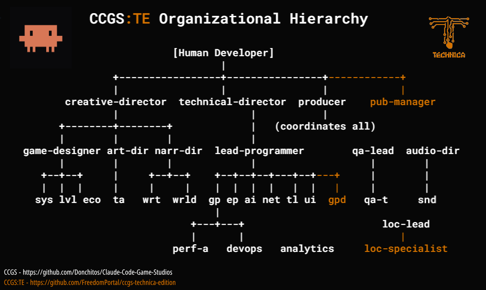

<p align="center">
  
  <h1 align="center">Claude Code Game Studios: Technica Edition</h1>
  <p align="center">
    A CCGS fork that enhances AI agent game development framework with publishing workflow.
    <br />
   Extend base framework with: Go-To-Market Layer,  Post-Launch Lifecycle, and Session Continuity.
  </p>
</p>

<p align="center">
  <a href="LICENSE"></a>
  <a href=".claude/agents"></a>
  <a href=".claude/skills"></a>
  <a href=".claude/hooks"></a>
  <a href=".claude/rules"></a>
  <a href="https://docs.anthropic.com/en/docs/claude-code"></a>
  <a href="https://wise.com/pay/me/wams1"></a>
</p>

---

> _**Fork of:** [CCGS — Claude Code Game Studios](https://github.com/Donchitos/Claude-Code-Game-Studios) by Donchitos - MIT License (original copyright retained)_
>
> _**CCGS base version:** v1.0.0 stable release (2026/05/14) - **Technica Edition:** Maintained by FreedomPortal (Technica Games)_

## What Is CCGS:TE?

CCGS is a Claude Code agent framework for game development — 48+ specialized AI agents organized as a studio hierarchy, coordinated around a 7-stage production pipeline. The base framework covers everything from concept to release. What it doesn't cover is what comes after you ship, or what you need to reach players in the first place.

CCGS:TE is a fork that extends the base framework in three directions and expand the pipeline to 9 stages, covering real world game development business life cycle:

| Addition | What it adds |
|----------|-------------|
| **Go-To-Market Layer** | Marketing, community, press outreach, store presence, social publishing |
| **Post-Launch Lifecycle** | Live ops strategy, DLC design, monetization, post-mortems |
| **Workflow & Continuity** | Session resume, knowledge persistence, toolchain setup, demo workflow, expanded localization |
| **9-stage Pipeline** | 'Prototype' added after Conceptual and 'Vertical Slice' is put between Pre-Production and Production |

The result: CCGS covers *Build → Ship* —  CCGS:TE covers *Build → Ship → Operate → Grow*

<br />
  

> _**Disclaimer:** The CCGS:TE repo remains a fork of CCGS and maintains only the extension works. 
> The existing game development aspects of the framework are maintained in the CCGS base repo._

<br />

## Table of Contents
- [New Agents](#new-agents)
- [New Skills](#new-skills)
- [New Hooks](#new-hooks)
- [Workflow Changes](#workflow-changes)
- [Pipeline Integration](#pipeline-integration)
- [Roadmap](#roadmap)
- [Getting Started](#getting-started)
- [Attribution](#attribution)

## New Agents

### `publishing-manager`
The business-side director-lite. Owns the entire player-facing lifecycle from pre-launch positioning through post-launch community. Runs a publishing roadmap parallel to the development pipeline.

**Domain:** All `/export-*` skills, press outreach, marketing plan, community plan, team-publish.

---

### `game-pipeline-developer`
Owns pipeline tools that operate outside the game engine: asset processors, data exporters, format converters, and automation scripts. Also owns the system-level workflow skills (setup-tool, checkpoint, resume, publish-check, export-build).

**Domain:** Tools that bridge content creation and the game engine. Runs isolated from `src/`.

---

### `localization-specialist`
Handles localization execution under `localization-lead` direction. String wrapping, context validation, LQA (overflow, tone, placeholder, cultural checks), and translation sync when source text changes.

**Domain:** String implementation and validation. The `localization-lead` handles strategy; this agent executes.

---

### `growth-analyst`
Owns the player insight loop — telemetry design, player segmentation, A/B test design, retention curve analysis, and economy simulation. Bridges raw event data and actionable design decisions.

**Domain:** Analytics strategy, behavioral cohort definitions, A/B test review, retention benchmarks, resource flow projections.

---

## New Skills

### Onboarding & Continuity

| Skill | Purpose |
|-------|---------|
| `/setup-tool` | Configure a standalone tool project — creates `TOOL_SPEC.md`, routes to `game-pipeline-developer` |
| `/continue` | Read session state and agent memory; present a brief so you pick up immediately where you left off |
| `/checkpoint` | Flush session discoveries to agent memory files — call proactively before crashes or `/clear` |
| `/memory-shard` | Split an agent's flat `MEMORY.md` into topic shards — run when any agent's memory exceeds ~150 lines |
| `/memory-prune` | Remove stale forward-looking entries from agent memory and session state — run at sprint boundaries or before `/gate-check` and `/architecture-review` |
| `/autosave-mode` | Configure crash-protection level for long tasks: `off` / `remind` / `enforce` — set once per project, survives sessions |
| `/review-mode` | Change the project-wide director review level: `full` (every key step) / `lean` (phase gates only) / `solo` (no director reviews) — updates `production/review-mode.txt`, respected by 40+ skills |
| `/log-lesson` | Encode a lesson from external review, playtesting, or press feedback into `production/publishing/writing-lessons.md` |
| `/wishlist` | Lightweight holding area for uncommitted ideas — distinct from the backlog (committed work). Modes: add, view, promote, defer, prune. Data: `production/wishlist.yaml`. |

---

### Marketing & Growth

| Skill | Purpose |
|-------|---------|
| `/market-research` | Competitive intelligence — comp titles, pricing benchmarks, audience profile, platform fit, release timing, market gap analysis. Output feeds `/marketing-plan` and `/press-outreach` |
| `/marketing-plan` | Full publishing roadmap — community strategy, pre-launch milestones, content cadence |
| `/community-plan` | Platform setup, content calendar, metric tracking (wishlists, followers, engagement) |
| `/analytics-setup` | Design player event tracking — what to instrument, platform choice, implementation in engine |
| `/press-outreach` | Build media contact list, draft outreach templates, track status in `production/publishing/press-contacts.md` |

---

### Publishing & Distribution

| Skill | Purpose |
|-------|---------|
| `/publish-check` | Audit publishing roadmap vs. dev stage — surfaces overdue tasks and unlocked actions (also runs automatically at session start) |
| `/publish-steam-page` | Compile store page copy — short/long descriptions, feature list, tags — from GDDs and writing-lessons.md |
| `/publish-devlog` | Draft devlog post — reads session state, sprint history, GDDs; enforces writing-lessons rules |
| `/publish-social` | Batch social content for scheduled platforms |
| `/publish-pitch` | Investor/publisher pitch deck content |
| `/publish-review` | Structured press/review copy |
| `/publish-crowdfunding` | Crowdfunding campaign content |
| `/team-publish` | Parallel team run: publishing-manager + community-manager + writer — unified publishing status output |

---

### Post-Launch Lifecycle

| Skill | Purpose |
|-------|---------|
| `/live-ops-plan` | Strategic post-launch plan — content cadence, seasonal events calendar, retention mechanics |
| `/monetization-design` | Revenue model design with ethical guardrails — flags pay-to-win patterns and dark patterns explicitly |
| `/dlc-design` | DLC content package design — scope, pricing, content list, timeline |
| `/mod-support` | Mod support architecture — what to expose, tooling for modders, community integration |
| `/post-mortem` | Structured retrospective after milestones or at release — what worked, what didn't, one concrete process change |

---

### Demo Workflow

The demo track is a **parallel branch**, not a pipeline stage. It can run alongside Production or Polish. Each demo campaign has its own state at `production/demo/[id]/state.txt`, advanced only by `/demo-gate`.

Full chain: `/demo-plan` → `/demo-scope` → `/demo-build` → `/demo-playtest` → `/demo-feedback` → `/demo-iterate` → `/demo-polish` → `/demo-gate [id] released` → `/demo-integrate`.

For Early Access: add `--early-access` to `/demo-plan` and `/demo-build`. Two additional sub-stages (Publishing → Live) activate, along with EA pricing/roadmap requirements.

| Skill | Purpose |
|-------|---------|
| `/demo-plan` | Goals, milestones, effort estimate, and risk register for the demo production effort |
| `/demo-scope` | Define demo boundaries — what content is included, what is cut, what impression to leave |
| `/demo-build` | Export and validate a playable demo build with content gate and save isolation checks |
| `/demo-playtest` | Structured playtest protocol for demo-specific goals (first impressions, conversion) |
| `/demo-feedback` | Aggregate 2+ playtest sessions into cross-session patterns with a go/no-go release verdict |
| `/demo-iterate` | Targeted blocker resolution: scope minimum fix → delegate to `/dev-story` or `/bug-report` → verify |
| `/demo-polish` | Demo-specific polish scoped to first-impression, onboarding clarity, and end-state CTA conversion |
| `/demo-status` | Read-only snapshot of all active demo campaigns — confidence, artifact status, blockers for next advance |
| `/demo-gate` | Formal sub-stage gate — evaluates checklist, writes `state.txt` on PASS |
| `/demo-integrate` | Post-demo back-integration — classifies changes as keep-demo-only / backport / needs-story; EA mode flags roadmap commitments as Required 1.0 stories |

---

### Localization Suite

The l10n track is an **opt-in side track** activated at `/start`. Intent (YES / NO / LATER) is captured at Concept and stored in `production/localization/intent.md`. Gate-check surfaces l10n requirements at key stages; session-start shows live status when intent = YES.

Full pipeline: `/l10n-i18n` → `/l10n-prepare` → `/l10n-integrate` → `/l10n-sync` → `/l10n-qa` → `/l10n-cultural-review` → `/l10n-rtl` (RTL locales) → `/l10n-vo` (voiced games).

| Skill | Purpose |
|-------|---------|
| `/l10n-check` | Stage-aware status snapshot — shows what's done, missing, or overdue for the current pipeline stage |
| `/l10n-i18n` | i18n readiness audit — number/date/currency formatting, plural gaps, string concatenation, locale-naive code patterns |
| `/l10n-prepare` | Scan for unwrapped strings, wrap in `tr()`, scaffold string table with plural form support |
| `/l10n-integrate` | Mid-pipeline — export with translator brief + screenshot checklist, import translations |
| `/l10n-sync` | Detect stale translations after source text changes |
| `/l10n-qa` | LQA pass — overflow, placeholders, plural form counts, tone, cultural checks |
| `/l10n-cultural-review` | Standalone cultural sensitivity review of source content per locale |
| `/l10n-rtl` | RTL layout validation for Arabic/Hebrew/Persian/Urdu locales |
| `/l10n-vo` | Voice-over pipeline — recording manifest, scripts, audio validation, code integration |

---

### Production Additions

| Skill | Purpose |
|-------|---------|
| `/export-build` | Export release build via engine headless export — logs version, platform, timestamp to `production/qa/builds.md` |
| `/taste-gate` | Human taste approval checkpoint before batch AI image generation. |
| `/refine-copy` | Remove AI writing patterns from player-facing copy — 8-pass editorial filter covering structure, vocabulary, rhythm, hedging, and voice. Called automatically by all export skills. |

---

### Coding Agent Tools

Skills that improve how coding agents understand and debug code. Engine-aware: detect the active engine from `technical-preferences.md` and apply Godot, Unity, or Unreal heuristics.

| Skill | Purpose |
|-------|---------|
| `/code-recon` | Map the full dependency footprint of a file or system before touching it — callers, callees, signals/events/delegates, scene/prefab refs, global singletons. Read-only. Produces a map, makes no changes. |
| `/diagnose` | Structured 6-phase debugging workflow: establish a fast feedback loop (hard gate) → reproduce → hypothesize → instrument → fix + regression test → cleanup + post-mortem. Prevents thrashing on non-obvious bugs. |
| `/entropy-scan` | Proactive entropy scan — walks `src/` for friction points (God Scripts, scene coupling, autoload sprawl, etc.) and generates a report with before/after Mermaid deepening diagrams. Engine-aware (Godot/Unity/Unreal). Read-only on game code. Run every few sprints. |
| `/run-tests` | Run the project test suite headlessly (all / unit / integration / single file). Engine-aware: routes to GDUnit4, Unity Test Runner, or Unreal headless runner from `technical-preferences.md`. Returns pass/fail counts and failure details. |

---

### Coverage & Gap Analysis

Four skills that answer "is everything that should exist actually there?" Each scans a different layer and cross-references it against the design source of truth. Together they form a complete production health check.

| Skill | Purpose |
|-------|---------|
| `/gdd-coverage [--roadmap] [--update-index]` | Audit GDD files vs. `systems-index.md` — which systems have no GDD, which have incomplete sections (0–8), ADR gaps. `--roadmap` writes `production/doc-roadmap.md`. `--update-index` syncs status fields. |
| `/asset-coverage [--roadmap] [--update-manifest]` | Audit asset delivery: cross-references `design/assets/asset-manifest.md` (Done/Approved entries) against actual files in `assets/`. Flags missing files, orphan files, status mismatches. `--roadmap` writes `production/asset-roadmap.md`. |
| `/data-schema-coverage [type] [--report] [--roadmap]` | Audit game data files for schema completeness — extracts required fields from GDDs, then checks every JSON/YAML/tres/CSV in `assets/data/` for missing or empty fields. Answers "are all weapon/enemy/item definitions complete?" `--roadmap` writes `production/data-roadmap.md`. |
| `/project-gap [milestone] [--stories] [--write]` | **Meta-aggregator.** Runs lightweight inline scans across all four layers (GDD, data, asset delivery, story/backlog) and produces a single priority-ordered gap list. Collapses root causes, assigns a specific skill to every gap. Answers "what still needs to be made?" `--stories` pipes top gaps into `/create-stories`. |

**Roadmap stack** — four complementary planning files, one per layer:

| File | Generated by |
|------|-------------|
| `production/roadmap.yaml` | `/roadmap init` — system-to-milestone scope |
| `production/doc-roadmap.md` | `/gdd-coverage --roadmap` — GDD + ADR authoring plan |
| `production/asset-roadmap.md` | `/asset-coverage --roadmap` — asset production plan |
| `production/data-roadmap.md` | `/data-schema-coverage --roadmap` — data definition plan |
| `production/project-gap-[date].md` | `/project-gap --write` — unified cross-layer gap list |

---

## New Hooks

### `git-guardrails.sh`
**Event:** `PreToolUse` (Bash)
**Function:** Blocks destructive git commands before they execute — `reset --hard`, `push --force/-f`, `clean -f`, `branch -D`, and bare `checkout --`. Each block explains the danger, offers a safe alternative, and shows the user how to bypass with `! <command>` if they have confirmed intent. Warn-only for single-file `checkout -- <file>`.

This hook turns the `workflow.md` git safety guidance from documentation into enforcement.

---

### `memory-checkpoint.sh`
**Event:** `PostToolUse` (Write \| Edit)
**Function:** After every file write or edit, checks whether the change contains cross-session-relevant information and prompts agent memory update if so.

This hook makes `/checkpoint` semi-automatic. The manual `/checkpoint` skill is still needed for deliberate end-of-session flushes.

---

### `pre-approval-check.sh`
**Event:** `PreToolUse` (AskUserQuestion)
**Function:** Intercepts approval-gate questions ("May I write…", "write this sprint plan…", etc.) and enforces the Draft-First Protocol based on `production/autosave-mode.txt`:

| Mode | Behavior |
|------|----------|
| `off` | No action — passes through immediately |
| `remind` | Prints stderr reminder to write draft before approval (default) |
| `enforce` | Blocks with exit 2 unless a draft file exists in `production/session-state/drafts/` modified within the last 3 minutes |

Configure with `/autosave-mode` or set directly in `production/autosave-mode.txt`.

---

## Workflow Changes

### Session Continuity System
The most significant architectural addition. Three parts work together:

1. **`production/session-state/active.md`** — living checkpoint updated after every significant milestone. Contains: current task, progress checklist, key decisions, files in progress, open questions.
2. **`/checkpoint`** — explicit flush to agent memory (`.claude/agent-memory/[agent]/MEMORY.md`). Call before `/clear`, before long breaks, after major decisions.
3. **`/continue`** — reads `active.md` + agent memory + session logs and presents a brief on open. No session lost to context compaction.

`session-start.sh` was extended to detect and preview `active.md` automatically every session open.

### `/help` → `/next`
Base CCGS used `/help` as the "what do I do next?" navigation skill. This conflicts with Claude Code's built-in `/help` command. Renamed to `/next` in CCGS:TE. All internal references updated.

### Draft-First Protocol (Crash Resilience)

Skills that do expensive multi-agent work — code review, sprint planning, architecture review, gate checks, design review — now write their output to `production/session-state/drafts/` **before** asking for approval. If a crash or token limit hits at the `[y/N]` prompt, the draft survives and the maximum rework is re-running the approval step, not the entire task.

The `SubagentStop` hook was extended to also write each subagent's final output to `drafts/` — so if a parent session dies after a programmer subagent finishes writing code, the implementation summary is recoverable.

Configure the enforcement level with `/autosave-mode` (or set at onboarding via `/start`):
- `off` — no protection
- `remind` — Claude gets a reminder before each approval gate (default)
- `enforce` — hard block until a draft file is confirmed on disk

---

### Domain Glossary (`docs/CONTEXT.md`)

A living vocabulary file at `docs/CONTEXT.md` — canonical names for game concepts, systems, entities, and UI elements, distinct from GDDs (which are mechanics specs). Its sole purpose is preventing naming drift across sessions and agents.

- **Coding agents:** Read it before implementing in any system. Use canonical terms only — do not invent synonyms.
- **Design agents:** When a GDD introduces new terminology, add it to `docs/CONTEXT.md` immediately — do not defer.
- **All agents:** If a term conflict exists between code and CONTEXT.md, flag it before proceeding.

`docs/CONTEXT.md` ships as a template with five sections: Core Game Concepts, Systems Vocabulary, Character/Entity Names, UI Terminology, and Forbidden Aliases. It stays empty until the game concept is established and fills as design matures.

---

### Status Line: Rate Limit Awareness + Sprint Tracking

`statusline.sh` upgraded to a dual-line display that surfaces token pressure and sprint context:

```
🤖 Claude Haiku 4.5 | ctx: 42% | 5h: 61% 1h 20m | 7d: 38% 4d 2h | my-game (main)
🎯 Production [lean] | Sprint 3 | Combat System > Melee Combat > Hitbox detection
```

New segments:
- `5h` / `7d` — rate limit percentage and relative reset countdown
- `Sprint N` — current sprint number from `production/sprint-status.yaml`, shown for Pre-Production through Release stages
- Color coding on all three percentage indicators: green < 50%, yellow 50–79%, red ≥ 80%
- Repo name + current branch in the first line

---

### Design Review: Error Horizon Collapse Prevention

`/design-review` now classifies every finding before deciding whether it blocks:

| Tag | Meaning | Action |
|-----|---------|--------|
| `[DESIGN]` | Fundamental design flaw — logic broken, player fantasy unmet | Always blocks |
| `[IMPL]` | Implementation detail — solvable in code without GDD change | Never blocks |
| `[SPEC]` | Ambiguity or imprecision — can be resolved with a note | Blocks only pass 1–2 |

**Reclassification Gate**: before the verdict, the review agent reclassifies any finding that escalated from recommended → blocking across passes. Pass ≥ 3 requires new external evidence to sustain a blocking escalation. Pass ≥ 6 auto-offers a minimum viable fix path. 

New verdict: `APPROVED WITH IMPLEMENTATION NOTES` — design is sound; remaining items are `[IMPL]` concerns logged for `/dev-story`.

`/review-all-gdds` and `/architecture-review` use equivalent classification schemes (`[STRUCTURAL]/[DESIGN]/[SPEC]` and `[COVERAGE]/[CONFLICT]/[SPEC]` respectively) with the same reclassification gate style.

---

### Coding Agent Behavioral Guidelines

`.claude/rules/coding-agent-behavior.md` encodes four non-negotiable principles for all coding agents (`gameplay-programmer`, `engine-programmer`, `ui-programmer`, `godot-gdscript-specialist`, etc.):

1. **Think Before Execute** — state assumptions; present alternatives; stop and ask when confused
2. **Simplicity First** — minimum code that satisfies acceptance criteria; no speculative features
3. **Surgical Changes** — touch only what the story requires; don't "improve" adjacent code
4. **Goal-Driven Execution** — derive verifiable goals from ACs; write tests first; clarify before implementing

Applied by `/dev-story` in the programmer agent brief.

---

### Sprint Close-Out Sequence Enforcement

`.claude/rules/workflow.md` hard-enforces the close-out order:

```
/milestone-review → /smoke-check sprint → /team-qa sprint → /retrospective → /gate-check → /sprint-plan new
```

Run the full sequence with one command: **`/sprint-close`** (`.claude/skills/sprint-close/SKILL.md`). It runs all five steps in order with gate-and-record confirmation at each step, then prints the Sprint #N: CLOSED declaration. `/sprint-plan new` is run separately in a fresh session.

`/sprint-plan new` checks for `production/retrospectives/retro-sprint-[N]-*.md` before generating a plan. If the file is missing: **BLOCKED** — must run `/retrospective` first. Prevents velocity data loss and repeated process failures across sprint boundaries.

---

### Backlog System & Scope Visibility

`/roadmap`, `/wishlist`, `/backlog`, and `/milestone-define` form the scope pipeline: a persistent, cross-sprint registry with a clear authority chain.

**Pipeline:** `/roadmap` defines scope → `/create-epics` uses it → `/create-stories` fills it → `/backlog` tracks it

**Solution — four-file architecture:**

| File | Role |
|------|------|
| `production/roadmap.yaml` | **Scope authority** — assigns every system to a milestone. Written by `/roadmap`, read by `/create-epics`, `/backlog`, `/sprint-plan`. Never edit manually. |
| `production/backlog.yaml` | **Canonical story registry** — all stories, all epics, all time. |
| `production/sprint-status.yaml` | **Sprint view** — current sprint slice only. Regeneratable from backlog if lost. |
| `production/roadmap.md` | **Human view** — epic-to-milestone table + velocity horizon. Generated from roadmap.yaml. |
| `production/wishlist.yaml` | **Ideas holding area** — uncommitted ideas (raw/refined/deferred/promoted). Never auto-promoted to backlog. |
| `production/milestones/definitions/[name].md` | **Scope contract** — what a milestone includes, excludes, quality bar, and exit criteria. |

**Staleness prevention** — three skills write to `backlog.yaml` automatically:
- `/story-done` — marks story done, sets `completed_date`
- `/sprint-close` — syncs sprint outcomes (done or carried-over)
- `/sprint-plan new` — adds new sprint stories with status `in-sprint`

**Scope awareness** — `production/milestones/active.txt` holds the current target milestone name. Scope-aware skills (`/gate-check`, `/sprint-plan` Phase 0.5, `/architecture-review`, `/backlog view`) read this to filter and prioritize.

**Setup commands:**
```
/roadmap init              # First-time scope definition — reads GDDs, assigns systems to milestones
/roadmap update            # Re-sync after new GDDs or epic status changes
/roadmap view              # Read-only render of current scope state
/wishlist add              # Capture an idea without committing it to scope
/backlog init              # Build backlog.yaml from existing epics (one-time, after /roadmap init)
/milestone-define init [name]  # Write a scope contract for a milestone
```

---

### Code Review Auto-Detection in Story-Done

`/dev-story` now makes `/code-review` the sole next step — `/story-done` is not mentioned until after code review passes.

`/story-done` replaces the manual "did you run code review?" question with session state detection in lean and full mode. If evidence of code review is found, it will proceed silently without asking.

---

### Platform Reference Docs (`docs/reference/platform/`)

Date-stamped submission guides for every major storefront, mirroring the `docs/engine-reference/` pattern. Exists because LLM training data goes stale and platform policies change constantly.

| Platform | Coverage |
|----------|----------|
| Steam | OVERVIEW, submission checklist, store page asset requirements |
| Epic Games Store | OVERVIEW, EOS SDK requirements, submission checklist |
| itch.io | OVERVIEW, submission checklist, butler CLI workflow |
| iOS App Store | OVERVIEW, Review Guidelines summary, submission checklist |
| Google Play | OVERVIEW, policy summary, submission checklist |
| PlayStation | OVERVIEW, TRC stub (fill from dev portal — NDA), submission checklist |
| Xbox | OVERVIEW, TCR stub (fill from dev portal — NDA), submission checklist |
| Nintendo Switch | OVERVIEW, Lotcheck stub (fill from dev portal — NDA), submission checklist |

Console cert files (TRC/TCR/Lotcheck) are intentional stubs — the actual requirements are NDA-gated. Fill them from your dev portal after signing the developer agreement. The `release-manager` agent reads the relevant platform directory before any submission task.

---

### `writing-lessons.md` Knowledge Base
Located at `production/publishing/writing-lessons.md`. All `/export-*` skills read this file before generating output. Use `/log-lesson` to add entries. Format: context → problem → rule → example. Decisions marked as settled are not re-debated by agents.

---

## Pipeline Integration

CCGS:TE skills map onto the 9-stage pipeline as a **parallel publishing track**. No base pipeline stages are removed or restructured.

| Stage | New skills that activate |
|-------|--------------------------|
| 1 — Concept | `/market-research`, `/marketing-plan`, `/monetization-design` |
| 2 — Prototype | *(no new skills — `/prototype` is a base skill)* |
| 3 — Systems Design | `/analytics-setup`, `/telemetry-design` |
| 4 — Technical Setup | `/setup-tool` (if pipeline tool work in scope) |
| 5 — Pre-Production | `/taste-gate`, `/community-plan`, `/tutorial-design` |
| 6 — Vertical Slice | `/tutorial-design` (if tutorial is part of VS loop) |
| 7 — Production | `/publish-devlog`, `/publish-social`, `/live-ops-plan`, `/export-status`, `/balance-sim`, `/player-segmentation` |
| 8 — Polish | `/publish-steam-page`, `/press-outreach`, `/publish-pitch`, `/player-docs manual`, `/player-docs help-text`, `/economy-simulation` |
| 9 — Release | `/export-build`, `/team-publish`, `/post-mortem`, `/player-docs guide` |
| Post-Launch | `/dlc-design`, `/mod-support`, `/live-ops-plan` (operational), `/retention-analysis`, `/ab-test`, `/player-segmentation` (ongoing), `/economy-simulation` (live) |
| **Demo track** (parallel — branches from Production or Polish) | `/demo-plan`, `/demo-scope`, `/demo-build`, `/demo-playtest`, `/demo-feedback`, `/demo-iterate`, `/demo-polish`, `/demo-status`, `/demo-gate`, `/demo-integrate` |
| **L10n track** (parallel opt-in — activated at Concept, gates at Technical Setup / VS / Production / Polish / Release) | `/l10n-check`, `/l10n-i18n`, `/l10n-prepare`, `/l10n-integrate`, `/l10n-sync`, `/l10n-qa`, `/l10n-cultural-review`, `/l10n-rtl`, `/l10n-vo` |

`/publish-check` runs automatically at **every session start** via `session-start.sh` — surfaces overdue publishing tasks and unlocked actions without interrupting workflow.

---

## Roadmap

### Pending Implementation

**Module Reuse System** — export game systems as reusable packages:
- `/export-module` — extract a system (code + dependencies + docs) into a portable package structure for use in other projects on the same engine
- Includes adapter layer scaffolding for project-specific integrations
- Maps to architecture module boundaries from `/create-architecture`

**Engine Porting Workflow** — migrate code between game engines:
- `/port-engine` — inventory all engine-specific code via ADRs, map source → target API equivalents, generate prioritized migration guide
- Reads Engine Compatibility sections from all ADRs to build the crosswalk
- Produces `docs/porting/[source]-to-[target]-guide.md`

**Player Insight Loop** ✓ *Implemented (Phase 10)* — `growth-analyst` agent + 5 skills closing the data → decision loop:
- `/telemetry-design` — business question → minimum event set
- `/player-segmentation` — cohort definitions with behavioral thresholds and live ops levers
- `/ab-test` — design, review (statistical significance), and log A/B tests
- `/retention-analysis` — curve classification, drop-off identification, genre benchmark comparison
- `/economy-simulation` — resource flow projections, time-to-progression, inflation risk

---
## Getting Started

### Prerequisites

- [Git](https://git-scm.com/)
- [Claude Code](https://docs.anthropic.com/en/docs/claude-code) (`npm install -g @anthropic-ai/claude-code`)
- **Recommended**: [jq](https://jqlang.github.io/jq/) (for hook validation) and Python 3 (for JSON validation)

All hooks fail gracefully if optional tools are missing — nothing breaks, you just lose validation.

### Setup

1. **Clone or use as template**: (replace "my-game" with your project folder name)
   ```bash
   git clone https://github.com/FreedomPortal/ccgs-technica-edition.git my-game
   cd my-game
   ```

2. **Open Claude Code** and start a session:
   ```bash
   claude
   ```

3. **Run `/start`** — the system asks where you are (no idea, vague concept,
   clear design, existing work) and guides you to the right workflow. No assumptions.

   Or jump directly to a specific skill if you already know what you need:
   - `/brainstorm` — explore game ideas from scratch
   - `/setup-engine godot 4.6` — configure your engine if you already know
   - `/project-stage-detect` — analyze an existing project
   - `/publish-check` — start publishing workflow (Recommended if migrating project from CCGS)

### Migrating an Existing Project from CCGS

**Prerequisite:** This guide assumes your local repository already has two configured remotes: `origin` (your game project remote) and `upstream` (pointing to the original CCGS base repository).

You have two options for integrating CCGS:TE:

1. **Option 1: Replace the Upstream Source (Recommended for full adoption)**
   If you intend for CCGS:TE to be the single, primary source for the framework, use `set-url` to redirect the `upstream` remote.
   ```bash
   git remote set-url upstream https://github.com/FreedomPortal/ccgs-technica-edition.git
   git remote -v
      ```
2. **Option 2: Maintain Both Frameworks (For historical tracking)** 
If you need to keep the original CCGS history accessible while pulling the specialized features from CCGS:TE, rename the old upstream remote to `maintainer` and add the fork as a new upstream remote.
   ```bash
   git remote rename upstream maintainer
   git remote add upstream https://github.com/FreedomPortal/ccgs-technica-edition.git
   ```

### Keeping CCGS:TE in Sync with Upstream CCGS

Use `/ccgs-merge` to pull framework updates from CCGS base into your CCGS:TE folder without a shared git history. The skill does a full repo-to-repo diff, analyzes every diverged file during a planning phase (with per-hunk apply/skip/rewrite decisions), then executes the approved plan mechanically and writes a merge report.

**Setup** (one-time): point the skill at your clean CCGS source folder:
```bash
# run from your CCGS:TE folder
/ccgs-merge /absolute/path/to/ccgs-clean-folder
```
Path is saved to `.claude/ccgs-merge-paths.txt` (machine-local, gitignored) for future runs.

---

### Best Practice Tips
-   **Checkpointing:**  Use  `/checkpoint`  when a key decision is made (e.g., during design discussions). Follow up with  `/clear`  or  `/compact`  to manage context window size efficiently.
-   **Session Flow:**  Always end a session using  `/checkpoint`  to save the state. Resume work later using  `claude /continue`  to restore the context.
-   **Planning:**  Use  `/next`  to prompt the agent to analyze the current state and determine the optimal next action.
-   **Crash Protection:**  Run `/autosave-mode` once per project to set your protection level. Use `enforce` on unstable machines or during long multi-agent reviews. Drafts accumulate in `production/session-state/drafts/` and can be safely deleted after each session.
-   **Memory Hygiene:**  When an agent's `MEMORY.md` grows past ~150 lines, run `/memory-shard [agent]` to split it into topic shards — agents then load only what's relevant. At sprint boundaries or before `/gate-check`, run `/memory-prune [agent]` to remove stale forward-looking entries that would otherwise cause false blockers.
---

## Attribution

- CCGS: Technica Edition is a fork of **CCGS — Claude Code Game Studios** by **Donchitos**, licensed under MIT.<br />
Original repository: https://github.com/Donchitos/Claude-Code-Game-Studios <br />
All additions and modifications are by Technica Games. The MIT license text and original copyright notice are retained in all distributions.

- The `/refine-copy` skill is adapted from **humanize-writing** by **jpeggdev**, licensed under MIT.<br />
Original repository: https://github.com/jpeggdev/humanize-writing

- The `coding-agent-behavior` rules is adapted from **andrej-karpathy-skills** by **multica-ai**, licensed under MIT.<br />
Original repository: https://github.com/multica-ai/andrej-karpathy-skills

- The `/diagnose`, `/code-recon`, and `/entropy-scan` skills are adapted from **skills** by **mattpocock**, licensed under MIT.<br />
Original repository: https://github.com/mattpocock/skills
